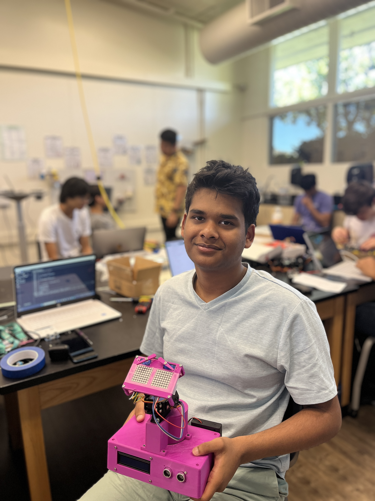
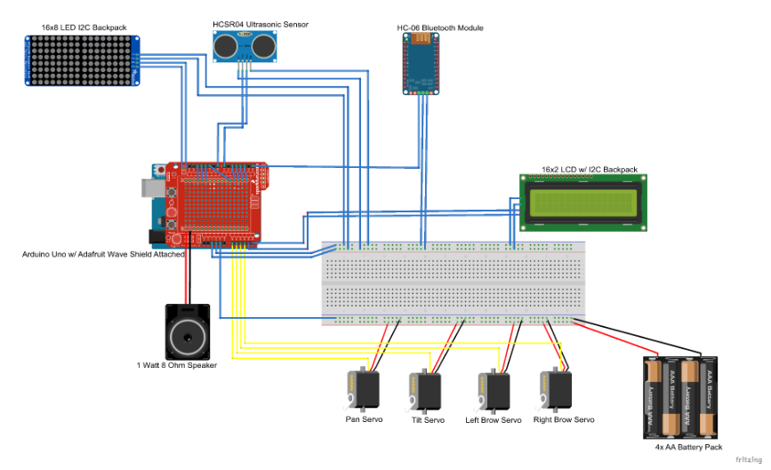

# Wall-E Robot
An emotionally responsive robot that uses artificial facial features like eyebrows and digital "eyes" to show a suite of emotions like happiness, sadness, and anger.



| **Engineer** | **School** | **Area of Interest** | **Grade** |
|:--:|:--:|:--:|:--:|
| Mukhil S | Monta Vista Highschool | Mechanical Engineering | Incoming Junior

<!---**Replace the BlueStamp logo below with an image of yourself and your completed project. Follow the guide [here](https://tomcam.github.io/least-github-pages/adding-images-github-pages-site.html) if you need help.**

-->
  
# Modification Milestone

For my final milestone, I have added a magic 8-ball feature for the robot. This feature works by the push of a button


# Third Milestone

<iframe width="560" height="315" src="https://www.youtube.com/embed/N1vvORsRSO8?si=XvQHQpjjWgKL0zbz" title="YouTube video player" frameborder="0" allow="accelerometer; autoplay; clipboard-write; encrypted-media; gyroscope; picture-in-picture; web-share" referrerpolicy="strict-origin-when-cross-origin" allowfullscreen></iframe>

<!---For your final milestone, explain the outcome of your project. Key details to include are:
- What you've accomplished since your previous milestone
- What your biggest challenges and triumphs were at BSE
- A summary of key topics you learned about
- What you hope to learn in the future after everything you've learned at BSE-->

For my third milestone of the Wall-E robot project, I have finally assembled all of my electrical components into the 3D printed enclosure of the robot. I have mounted the LED matrices, the LCD screen, the ultrasonic sensor, and the servos into thir respective slots. Before mounting on the servos, and attaching the head to the body, I made all the servos go to thir 90 degree positions in order to give ample of space for the parts to move on either side. I then coded the servos to react to all of the emotions. For happy, I made the head tilt upward, for sad and angry I made the head tilt downwards, and for surprised, I made the pan servos move from side to side. While putting the robot together, I faced the problem of one of the LEDs constantly turning off due to the lack of slack in a wire that disconnected often when the sevos made the head move up. For my final modification milestone, I will be adding a magic 8-ball feature that makes the robot nod "yes" or "no" randomly on the press of a button.


# Second Milestone

<iframe width="560" height="315" src="https://www.youtube.com/embed/cuj8OAAFLn4?si=XxH9Lxcir32arqjg" title="YouTube video player" frameborder="0" allow="accelerometer; autoplay; clipboard-write; encrypted-media; gyroscope; picture-in-picture; web-share" referrerpolicy="strict-origin-when-cross-origin" allowfullscreen></iframe>

For my second milestone, I have coded the 8x8 matrices to work with the ultrasonic sensor so that the "eyes" display different patterns for "emotions" when objects are placed in different distances from the sensor. The eyes start at a neutral position after a loading animation appears on the matrices and a welcome message on the LCD screen. When an object is placed at a distance {whatever it is}, the led's lights arrange themselves to resemble happy eyes. But as the object gets closer, the eyes change from happy to sad to angry and finally to surprised. This when paired with head movements and eyebrow movements, will allow the robot to portray human emotions accuratley. As rewarding as this milestone was, there were a few challenges when coding the matrices. It was particularly hard to make the expressions on the matrices and orient them properly as I had to map out each LED by using a byte of 1s and 0s to tell which LED should be on and off. For my final milestone, I will be coding the srvos to incorporate head movements and eyebrow movements, and I will be assembling the hardware by placing my components into the enclosure and mount my servos to the 3D Printed Body. 

<!---For your second milestone, explain what you've worked on since your previous milestone. You can highlight:
- Technical details of what you've accomplished and how they contribute to the final goal
- What has been surprising about the project so far
- Previous challenges you faced that you overcame
- What needs to be completed before your final milestone-->

# First Milestone

<iframe width="560" height="315" src="https://www.youtube.com/embed/QmMgxGSDIE8?si=Wymk5kahPlRH4V7R" title="YouTube video player" frameborder="0" allow="accelerometer; autoplay; clipboard-write; encrypted-media; gyroscope; picture-in-picture; web-share" referrerpolicy="strict-origin-when-cross-origin" allowfullscreen></iframe>

For my main project, I chose the Wall-E robot. I chose it because it gives my a well-rounded experience on the mechanical, electrical, and the software side. The Wall-E robot has two 8x8 LED matrices for eyes, an ultrasonic sensor, a LCD screen, and 4 servo motors (two micro, and two regular). For my first milestone, I have wired up all the eletrical components and tested them by making the servos move, making the LEDs light up, the LCD to display a message saying "Hello", and the ultrasonicc sensor by making it print the output on the serial monitor. After testing all of the components, I will be writing the final code for the project, assembling the body of the robot, and securing the electrical components into the designated compartments of the 3D printed body. A few difficulties when working on my project werere with my LED matrices. I was confused as to how I was supposed make patterns, and writing the test code for the rest of the components was also hard.


# Schematics 


<!--- Here's where you'll put images of your schematics. [Tinkercad](https://www.tinkercad.com/blog/official-guide-to-tinkercad-circuits) and [Fritzing](https://fritzing.org/learning/) are both great resoruces to create professional schematic diagrams, though BSE recommends Tinkercad becuase it can be done easily and for free in the browser. -->

# Code 

```
#include <Servo.h>
#include <LiquidCrystal_I2C.h>
#include <LedControl.h>
#include <Wire.h>
#include <EasyUltrasonic.h>

// Pins for the LED matrices
const int DIN_1 = 13;
const int CLK_1 = 11;
const int CS_1 = 12;
const int DIN_2 = 10;
const int CLK_2 = 8;
const int CS_2 = 9;

// Number of LED matrices
//const int NUM_MATRICES = 2;

// Create an instance of the LedControl library
LedControl ld = LedControl (DIN_1, CLK_1, CS_1);
LedControl lc = LedControl(DIN_2, CLK_2, CS_2);

byte happy_bmp[8] =
{ 
B00000000,
B00000000,
B01111110,
B01011010,
B01011010,
B00100100,
B00011000,
B00000000 };

byte loading1[8] =
{
B11111111,
B11111111,
B11110000,
B11110000,
B11110000,
B11110000,
B11111111,
B11111111
}; 

byte loading2[8] =
{
B11111111,
B11111111,
B00001111,
B00001111,
B00001111,
B00001111,
B11111111,
B11111111
};

byte neutral_bmp[8] =
{ B00000000,
B00111100,
B01000010,
B01011010,
B01011010,
B01000010,
B00111100,
B00000000 };


byte angryR_bmp[8] =
{
B00000000,
B00111100,
B01000011,
B01011010,
B01011100,
B01001000,
B00110000,
B00100000 };

byte angryL_bmp[8] =
{ B00000000,
B00111100,
B11000010,
B01011010,
B00111010,
B00010010,
B00001100,
B00000100 };

byte surprised_bmp[8] =
{ B01111110,
B10000001,
B10000001,
B10011001,
B10011001,
B10000001,
B10000001,
B01111110 };


byte sadR_bmp[8] =
{B00000000,
B00110000,
B01001000,
B01011100,
B01011010,
B01000010,
B00111100,
B00000000
};
//{ B00000000,
//B00111100,
//B01000010,
//B01011010,
//B00111010,
//B00010010,
//B00001100,
//B00000000 };

byte sadL_bmp[8] =
{ B00000000,
B00001100,
B00010010,
B00111010,
B01011010,
B01000010,
B00111100,
B00000000 };

byte love_bmp[8] =
{B00011000,
B00100100,
B01000010,
B10000001,
B10000001,
B10011001,
B10011001,
B01100110 };

byte blink_bmp[8] =
{ 
B00000000,
B00111100,
B01000010,
B00000000,
B00000000,
B00000000,
B00000000,
B00000000,
 };

byte no_bmp[8] =
{B11000011,
B11100111,
B01111110,
B00111100,
B00111100,
B01111110,
B11100111,
B11000011 };

byte yes_bmp[8] =
{B00100000,
B01110000,
B11011000,
B10001100,
B00000110,
B00000011,
B00000001,
B00000000,
};

Servo panservo;  // create servo object to control a servo
Servo tiltservo; 
Servo leftbrow;
Servo rightbrow;
// twelve servo objects can be created on most boards

int pos = 0;    // variable to store the servo position

LiquidCrystal_I2C lcd(0x27,  16, 2);

const int trigPin = 5;  
const int echoPin = 4;
EasyUltrasonic ultrasonic;

float duration, distance;

void setup() {
  Serial.begin(9600);
  //attach servos
  tiltservo.attach(3);
  panservo.attach(2);
  leftbrow.attach(1);
  rightbrow.attach(0);
    // Initialize each matrix

    lc.shutdown(0, false);       // Wake up the display
    lc.setIntensity(0, 8);       // Set brightness level (0 is min, 15 is max)
    lc.clearDisplay(0);          // Clear the display register
  
    ld.shutdown(0, false);       // Wake up the display
    ld.setIntensity(0, 8);       // Set brightness level (0 is min, 15 is max)
    ld.clearDisplay(0);          // Clear the display register

  //initialize lcd screen
  lcd.init();
  // turn on the backlight
  lcd.backlight();
  

  //welcome message
  delay(500);


  lcd.setCursor(0, 0);
  lcd.print ("Hello");
   for(int i=0; i < 8; i++){
      lc.setColumn(0, i, loading1[i]);
   }
  for(int i=0; i < 8; i++){
      ld.setColumn(0, i, loading1[i]);
   }
   delay(500);
  for(int i = 0; i < 8; i++){
      lc.setColumn(0, i, loading2[i]);
  }
  for(int i=0; i < 8; i++){
      ld.setColumn(0, i, loading2[i]);
  }
  delay(500);
 for(int i = 0; i < 8; i++){
      lc.setColumn(0, i, loading1[i]);
 }
  for(int i=0; i < 8; i++){
      ld.setColumn(0, i, loading1[i]);
 }
 delay(500);
  for(int i = 0; i < 8; i++){
      lc.setColumn(0, i, loading2[i]);
  }
  for(int i=0; i < 8; i++){
      ld.setColumn(0, i, loading2[i]);
  }
  delay(500);
  lcd.clear();
  for(int i=0; i < 8; i++){
      lc.setColumn(0, i, loading1[i]);
   }
  for(int i=0; i < 8; i++){
      ld.setColumn(0, i, loading1[i]);
   }
   delay(500);
  for(int i = 0; i < 8; i++){
      lc.setColumn(0, i, loading2[i]);
  }
  for(int i=0; i < 8; i++){
      ld.setColumn(0, i, loading2[i]);
  }
  delay(500);
 for(int i = 0; i < 8; i++){
      lc.setColumn(0, i, loading1[i]);
 }
  for(int i=0; i < 8; i++){
      ld.setColumn(0, i, loading1[i]);
 }
 delay(500);
  for(int i = 0; i < 8; i++){
      lc.setColumn(0, i, loading2[i]);
  }
  for(int i=0; i < 8; i++){
      ld.setColumn(0, i, loading2[i]);
  }
delay (500);
  lcd.print ("I'm Brobot");
  for(int i=0; i < 8; i++){
      lc.setColumn(0, i, loading1[i]);
   }
  for(int i=0; i < 8; i++){
      ld.setColumn(0, i, loading1[i]);
   }
   delay(500);
  for(int i = 0; i < 8; i++){
      lc.setColumn(0, i, loading2[i]);
  }
  for(int i=0; i < 8; i++){
      ld.setColumn(0, i, loading2[i]);
  }
  delay(500);
 for(int i = 0; i < 8; i++){
      lc.setColumn(0, i, loading1[i]);
 }
  for(int i=0; i < 8; i++){
      ld.setColumn(0, i, loading1[i]);
 }
 delay(500);
  for(int i = 0; i < 8; i++){
      lc.setColumn(0, i, loading2[i]);
  }
  for(int i=0; i < 8; i++){
      ld.setColumn(0, i, loading2[i]);
  }
  delay(500);
  lcd.clear();


 ultrasonic.attach(5,4);


}

void loop() {
   int i = 0;
    // draws pattern on left eye matrix
    
    int j = 0;
    // draws pattern on right eye matrix
   

  float distanceIN = ultrasonic.getDistanceIN();

  Serial.println (distanceIN);
  Serial.println ("neutral_bmp");
  
  
  if(distanceIN <= 2) {
    Serial.println("surprised_bmp");
    for (pos = 0; pos <= 180; pos += 1) { // goes from 0 degrees to 180 degrees
    // insteps of 1 degree
    panservo.write(pos);              // tell servo to go to position in variable 'pos'
    delay(3);                       // waits 15 ms for the servo to reach the position
    }
    for (pos = 180; pos >= 0; pos -= 1) { // goes from 180 degrees to 0 degrees
      panservo.write(pos);              // tell servo to go to position in variable 'pos'
      delay(3);                       // waits 15 ms for the servo to reach the position
    }
    int i = 0;
    // draws pattern on left eye matrix
    for(i = 0; i < 8; i++){
      lc.setColumn(0, i, surprised_bmp[i]);
    }
    int j = 0;
    // draws pattern on right eye matrix
    for(j = 0; j < 8; j++){
      ld.setColumn(0, j, surprised_bmp[j]);
    }
    
  }

  else if (distanceIN <= 5 && distanceIN > 2){
     Serial.println ("angry_bmp");
    for (i = 0; i < 8; i++){
       lc.setColumn(0, i, angryR_bmp[i]
       );
    }
    for (j = 0; j < 8; j++){
      ld.setColumn(0, j, angryL_bmp[j]);
    }
    
  }

  else if (distanceIN <= 10 && distanceIN > 5){
    Serial.println ("SadR_bmp");
    Serial.println ("SadL_bmp");

    for (i = 0; i < 8; i++){
       lc.setColumn(0, i, sadR_bmp[i]
       );
    }
    for (j = 0; j < 8; j++){
      ld.setColumn(0, j, sadL_bmp[j]);
    }
  }

  else if (distanceIN <= 15 && distanceIN > 10){
   
    for (i = 0; i < 8; i++){
       lc.setColumn(0, i, happy_bmp[i]
       );
    }
    for (j = 0; j < 8; j++){
      ld.setColumn(0, j, happy_bmp[j]);
    }
  }
 // else if ( )

  

  else {
     Serial.println ("neutral_bmp");
    for(i = 0; i < 8; i=i+1){     
      lc.setColumn(0, i, neutral_bmp[i]); 
    }
    for(j = 0; j < 8; j++){
       ld.setColumn(0, j, neutral_bmp[j]);
    }
  }  

  }

```

# Bill of Materials
Here's where you'll list the parts in your project. To add more rows, just copy and paste the example rows below.
Don't forget to place the link of where to buy each component inside the quotation marks in the corresponding row after href =. Follow the guide [here]([url](https://www.markdownguide.org/extended-syntax/)) to learn how to customize this to your project needs. 

| **Part** | **Note** | **Price** | **Link** |
|:--:|:--:|:--:|:--:|
| Arduino UNO R3 | Microcontroller that receives the code | $27.60 | <a href="https://www.amazon.com/Arduino-A000066-ARDUINO-UNO-R3/dp/B008GRTSV6/"> Link </a> |
| 8x8 LED Matrix | Eyes of the robot to show emotions | $8.39 | <a href="https://www.amazon.com/gp/product/B07W6KZR5D/ref=ox_sc_act_title_8?smid=A30QSGOJR8LMXA&psc=1"> Link </a> |
| LCD I2C Display | Display emotional state of the robot | $9.99 | <a href="https://www.amazon.com/gp/product/B019K5X53O/ref=ox_sc_act_title_7?smid=ADHH624DX2Q66&psc=1"> Link </a> |
| HC-SR04 Ultrasonic Sensor | find the distance from an object to change and trigger emotions | $6.99 | <a href="https://www.amazon.com/gp/product/B0B1MJJLJP/ref=ox_sc_act_title_6?smid=A1YZW40LYQY3L1&psc=1"> Link </a> |
| Mini Breadboard | used to mount button (MODIFICATION) | $5.99 | <a href="https://www.amazon.com/gp/product/B0B827VM95/ref=ox_sc_act_title_5?smid=A1YZW40LYQY3L1&psc=1"> Link </a> |
| Jumper Wires | Connecting all electrical components | $6.98 | <a href="https://www.amazon.com/gp/product/B01EV70C78/ref=ox_sc_act_title_4?smid=A2WWHQ25ENKVJ1&psc=1"> Link </a> |
| Push Button | To trigger 8-ball (MODIFICATION) | $7.99 | <a href="https://www.amazon.com/gp/product/B09R47N37H/ref=ox_sc_act_title_3?smid=A14FP9XIRL6C1F&psc=1"> Link </a> |
| 9g Micro Servos | Eyebrows | $7.99 | <a href="https://www.amazon.com/gp/product/B07MLR1498/ref=ox_sc_act_title_2?smid=A2QTZX14X1D97I&psc=1"> Link </a> |
| MG995 Servos | Neck tilt and pan | $16.59 | <a href="https://www.amazon.com/gp/product/B0CNVV92ZF/ref=ox_sc_act_title_1?smid=A1PKC2PUMNR8VD&psc=1"> Link </a> |

<!--- # Other Resources/Examples
One of the best parts about Github is that you can view how other people set up their own work. Here are some past BSE portfolios that are awesome examples. You can view how they set up their portfolio, and you can view their index.md files to understand how they implemented different portfolio components.
- [Example 1](https://trashytuber.github.io/YimingJiaBlueStamp/)
- [Example 2](https://sviatil0.github.io/Sviatoslav_BSE/)
- [Example 3](https://arneshkumar.github.io/arneshbluestamp/) -->


# Starter Project

<iframe width="560" height="315" src="https://www.youtube.com/embed/uZ-PfwZgxXo?si=0OI4P5rAvbiRFp-R" title="YouTube video player" frameborder="0" allow="accelerometer; autoplay; clipboard-write; encrypted-media; gyroscope; picture-in-picture; web-share" referrerpolicy="strict-origin-when-cross-origin" allowfullscreen></iframe>

  For my starter project, I went with the handheld arcade. I chose this project because I thought it was fun to use and it was also portable. This handheld arcade uses 2 8x8 LED Matrices and an LCD screen to display the game and scores respectively. It has foour arrow buttons to navigate and play games, and two more to slect and cancel. It is powered by 3 triple A batteries that make it capable of being used anywhere. Its features include A selection of five different games, adjustable brightness, and adjustable volume.

# Starter Bill of Materials  
  
| **Part** | **Note** | **Price** | **Link** |
|:--:|:--:|:--:|:--:|
| Vogurtime Retro Arcade Kit | Consists of all required components to make the arcade | $18.49 | [Link](https://www.amazon.com/dp/B094QRRHC2/ref=twister_B094QYXS9R?_encoding=UTF8&th=1)

